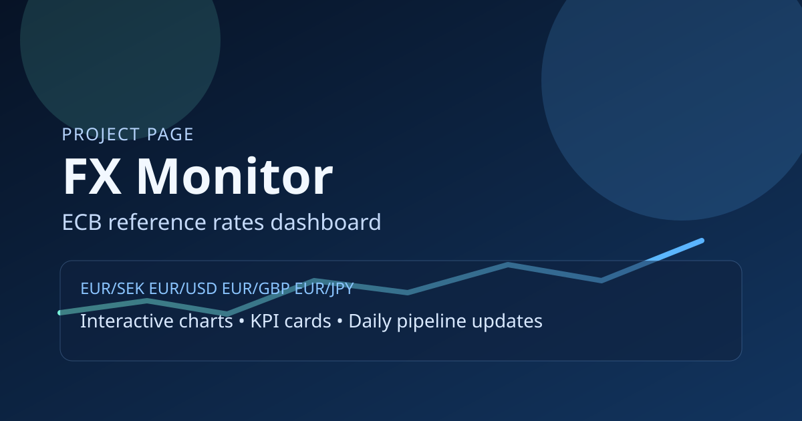
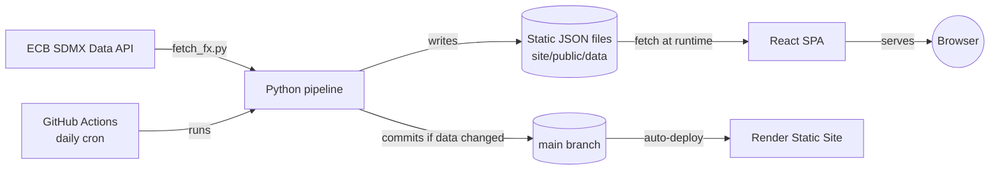

# FX Monitor

A statically-served fintech dashboard that visualizes ECB reference exchange rates with KPI cards, risk charts, and a multi-pair comparison mode — no backend, no database, just a Python data pipeline and a React frontend reading static JSON.

**Live demo:** [fx-monitor-tlpr.onrender.com](https://fx-monitor-tlpr.onrender.com)

---

## Screenshot



> The image above is the site's social-preview card, not a literal screenshot. Open the [live demo](https://fx-monitor-tlpr.onrender.com) to see the actual dashboard — interactive charts, comparison mode, and dark/light theme.
>
> _Real screenshots (desktop + mobile + comparison mode) TODO — add before the next portfolio pass._

---

## Features

- **Multi-pair coverage** — EUR/SEK, EUR/USD, EUR/GBP, EUR/JPY, EUR/NOK, EUR/CHF, all sourced from the ECB.
- **KPI cards** — latest rate, 1D/1W/1M change, 30-day moving average, 30-day volatility, min/max for the selected range.
- **Comparison mode** — overlay up to 3 pairs at once, normalized to an index-100 base so relative performance is directly comparable.
- **Risk charts** — rolling 30-day volatility, drawdown from peak, and a daily log-returns histogram.
- **Regime bands & event markers** — the main chart shades low/normal/high volatility periods and flags known macro/central-bank events.
- **Market snapshot panel** — 30-day trend, current volatility regime, and observation count at a glance.
- **Date ranges** — 30D / 90D / 365D / All, with shareable URL state (`pair`, `range`, `mode`, `compare` query params).
- **Bilingual UI** — Swedish/English toggle, plus a dark/light theme switcher with the preference saved in the browser.
- **Fully static** — the frontend only ever reads JSON files; there is no API server or database to operate.
- **Pipeline health badge** — a small footer indicator shows whether the last data refresh fully succeeded, partially failed, or failed outright, with the affected pairs listed on hover.

---

## Tech stack

| Layer | Choice |
|---|---|
| Data pipeline | Python 3.11, `requests` (ECB SDMX API), `pytest`, `ruff`, `black` |
| Frontend framework | React 18 + TypeScript (strict), Vite |
| Charts | Chart.js via `react-chartjs-2` |
| Testing | Vitest, React Testing Library, jsdom |
| CI | GitHub Actions — lint + typecheck + test + build + dependency audit on every PR/push, CodeQL + Dependabot for ongoing security, plus a daily data-refresh cron |
| Deployment | Render (Static Site) |

---

## Architecture



The pipeline and the frontend never talk to each other directly — the pipeline's only job is to turn ECB's API into a handful of JSON files, and the frontend's only job is to read and visualize them. This keeps the whole thing deployable as a static site with no server to operate, patch, or pay for.

---

## Why this exists

Most personal-finance dashboards either need a backend to poll and cache an API, or they hit a public API directly from the browser and get rate-limited or leak an API key. FX Monitor sidesteps both: a scheduled pipeline does the fetching and calculation once a day, and the site just serves the result. The interesting engineering is in the frontend — computing volatility, drawdown, and regime classification correctly from raw daily rates — not in server plumbing.

---

## Running locally

**Prerequisites:** Python 3.11+, Node.js 18+, npm

```bash
git clone https://github.com/AlexAhmanHV/fx-monitor.git
cd fx-monitor
```

### 1. Data pipeline

```bash
python -m venv .venv
.venv\Scripts\Activate.ps1   # or: source .venv/bin/activate
pip install -r pipeline/requirements.txt
python pipeline/fetch_fx.py --output-dir site/public/data --start-period 2015-01-01
```

Quality checks:

```bash
ruff check pipeline
pytest pipeline/tests
```

### 2. Frontend

```bash
cd site
npm install
npm run dev
```

Production build:

```bash
cd site
npm ci
npm run build
npm run preview
```

---

## Testing & CI

The frontend has 67 tests (Vitest + React Testing Library) covering every function in `lib/` — KPI math, volatility/drawdown/histogram calculations, regime-band grouping, formatting, and data validation — plus every component, including the four Chart.js-backed ones (tested by mocking `react-chartjs-2`'s exports rather than polyfilling a canvas, since the goal is verifying *this app's* data transformations, not re-testing Chart.js itself).

```bash
cd site
npm run test           # single run
npm run test:watch     # watch mode
npm run test:coverage  # coverage report (informational, not gated)
```

`.github/workflows/ci.yml` runs on every pull request and push to `main`: lint + typecheck + test + build for the frontend, and `ruff` + `pytest` for the pipeline. `.github/workflows/update-data.yml` is separate — it's the daily cron that actually refreshes the ECB data and auto-deploys via Render.

The pipeline isolates failures per currency pair: if one pair's fetch fails, the run logs the error and moves on rather than aborting — the other pairs still get fresh data, and the failing pair simply keeps its last-good file until the next successful run. Every run also writes a `status.json` summarizing the outcome per pair, and the live site's footer shows a small badge reflecting that status, so pipeline health is visible on the site itself, not just buried in Actions logs.

`ci.yml` also gates on dependency vulnerabilities: `npm audit --audit-level=high` for the frontend, `pip-audit` for the pipeline. On top of that, `.github/workflows/codeql.yml` runs GitHub CodeQL static analysis (JavaScript/TypeScript and Python) on every push/PR plus a weekly schedule, and `.github/dependabot.yml` opens a PR whenever an npm, pip, or GitHub Actions dependency has an update. See [SECURITY.md](SECURITY.md) for how to report a vulnerability.

---

## Data source

European Central Bank (ECB), EXR dataset via the SDMX Data API:

- `https://data-api.ecb.europa.eu/service/data/EXR/D.SEK.EUR.SP00.A?startPeriod=2015-01-01&format=csvdata`
- `https://data-api.ecb.europa.eu/service/data/EXR/D.USD.EUR.SP00.A?startPeriod=2015-01-01&format=csvdata`
- `https://data-api.ecb.europa.eu/service/data/EXR/D.GBP.EUR.SP00.A?startPeriod=2015-01-01&format=csvdata`
- `https://data-api.ecb.europa.eu/service/data/EXR/D.JPY.EUR.SP00.A?startPeriod=2015-01-01&format=csvdata`
- `https://data-api.ecb.europa.eu/service/data/EXR/D.NOK.EUR.SP00.A?startPeriod=2015-01-01&format=csvdata`
- `https://data-api.ecb.europa.eu/service/data/EXR/D.CHF.EUR.SP00.A?startPeriod=2015-01-01&format=csvdata`

ECB reference rates are published on banking days only; the pipeline and KPI calculations handle the resulting weekend/holiday gaps by falling back to the nearest earlier available rate rather than requiring an exact date match.

---

## Deployment

Render (Static Site):

- **Root:** repo root
- **Build command:** `cd site && npm ci && npm run build`
- **Publish directory:** `site/dist`
- **Auto-deploy:** enabled from `main`

The daily data-refresh workflow (`update-data.yml`) commits updated JSON straight to `main` when the ECB data changes, which triggers Render's auto-deploy — so the site stays current without anyone touching it.

---

## What this demonstrates

**Backend-free architecture done deliberately** — no database, no API server, and no client-side calls to a third-party API (avoiding both rate limits and key exposure). A scheduled batch job is the entire "backend."

**Correct handling of gapped time-series data** — `findPreviousByDays` (`site/src/lib/calc.ts`) falls back to the nearest earlier banking day rather than assuming every day has data, so 1D/1W/1M changes stay correct across weekends and holidays.

**A real, verified test suite** — every numeric assertion in the test suite (KPI math, volatility, drawdown, histogram binning, regime-band boundaries) was independently computed and checked against the actual source logic before being written, not just asserted against whatever the code happened to output.

**CI that gates the actual deliverable** — lint, typecheck, test, and build all run on every PR/push, separate from and non-interfering with the daily data-refresh cron.

**Security hygiene, not just feature work** — dependency vulnerabilities gate CI (`npm audit`, `pip-audit`), Dependabot keeps three ecosystems current on a weekly cadence, and CodeQL statically analyzes both languages on every push and weekly on a schedule.

**Graceful degradation over all-or-nothing failure** — a single pair's fetch error doesn't take down the whole daily run; the pipeline isolates it, keeps serving that pair's last-good data, and reports the outcome via `status.json`, which the frontend turns into a visible health badge.

---

## Possible future improvements

- **Anomaly alerts** — flag and surface days where a rate move exceeds N standard deviations.
- **More pairs / cross-rates** — beyond EUR-quoted pairs, e.g. SEK/USD computed via triangulation.
- **Historical event annotations sourced from data** — the current event catalog (`site/src/lib/analytics.ts`) is a small hardcoded list; a data-driven version could pull from a macro calendar API.
